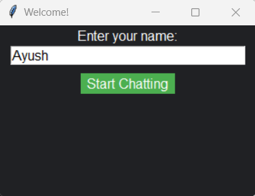
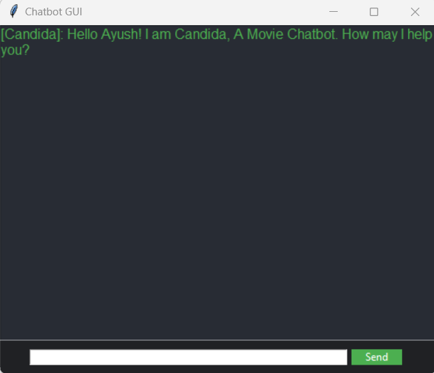
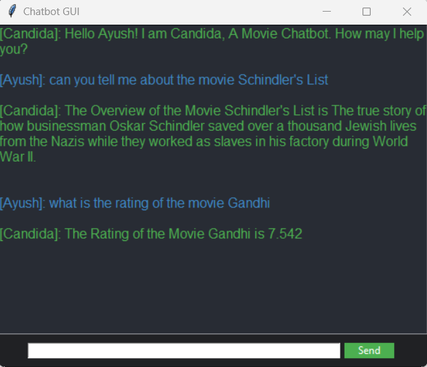
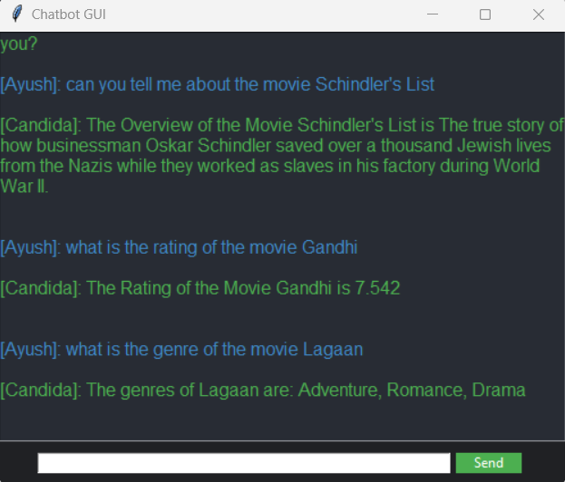
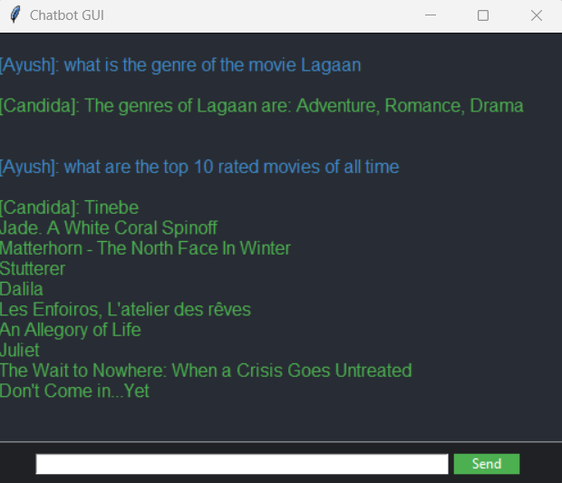
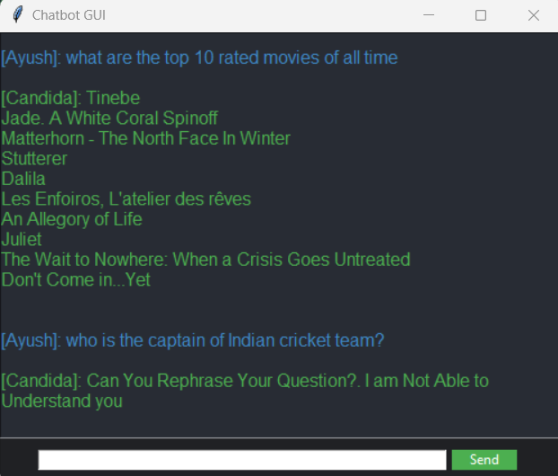

# MovieChatBot_Candida
Developed a Chatbot named Candida, That uses MovieDB api to get the relevent data based on the users prompt. Used regular expression to extract relevent information from the users prompt message and replied accordingly to that. Used Tkinter library to create a Chatbot GUI for better user interaction.

Screenshots of the Chatbot GUI

